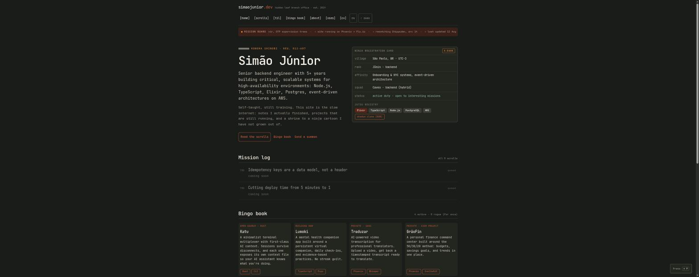
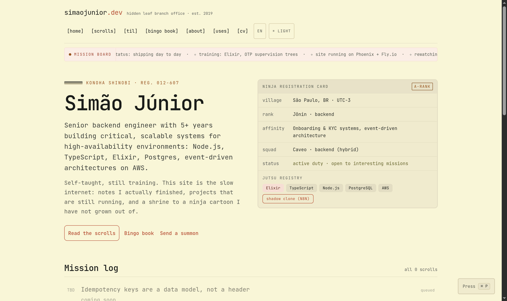
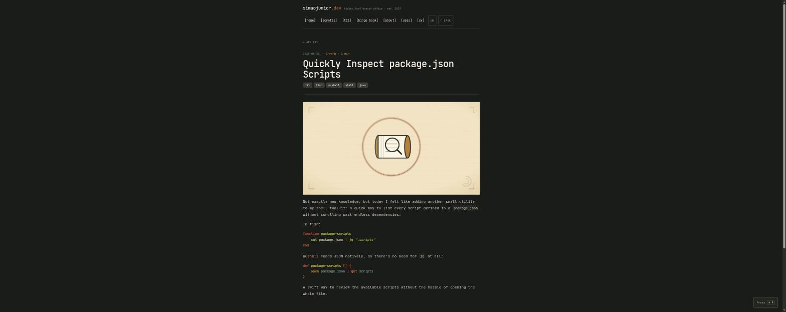
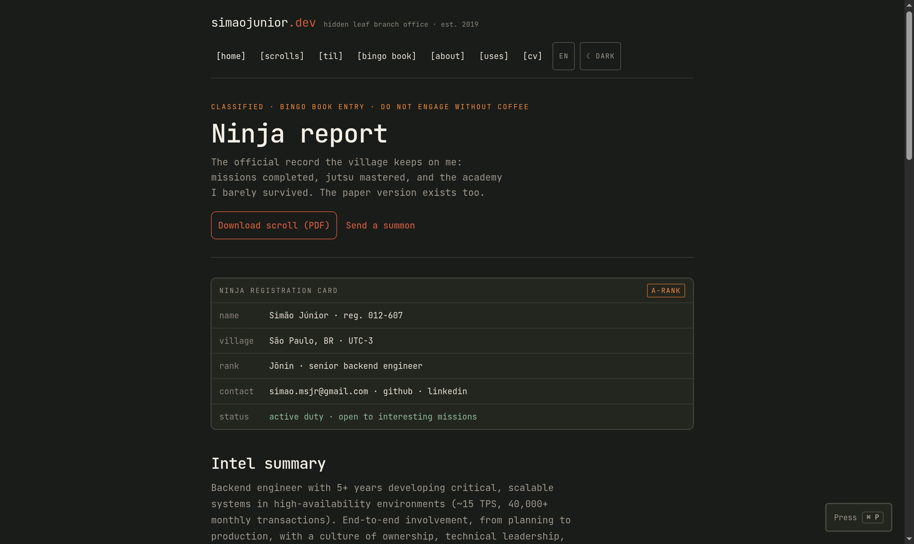

<p align="center">
  
</p>

<h1 align="center">simaojunior.dev</h1>

<p align="center">
  <strong>Archived.</strong> This is an old version of my personal site. It is
  no longer live at simaojunior.dev; the code is kept here for reference.
</p>

<p align="center">
  Personal website and blog, built with
  <a href="https://www.phoenixframework.org/">Phoenix</a> and
  <a href="https://github.com/dashbitco/nimble_publisher">NimblePublisher</a>.
  No database — posts are markdown files compiled at build time.
</p>

## Screenshots

<p align="center">
  
  
</p>
<p align="center">
  
  
</p>

## Development

The dev environment is a Nix flake (direnv auto-loads it via `.envrc`):

```sh
nix develop        # or `direnv allow` once, then it loads automatically
mix setup           # deps.get + assets.build
mix phx.server       # preview at http://localhost:4000
```

## Deploy (Fly.io)

The site runs on Fly.io as app `simaojunior-dev`, region `gru` (São Paulo).
Cloudflare sits in front for DNS only — the A/AAAA records point straight at
Fly, not through Cloudflare Pages.

```sh
flyctl deploy --app simaojunior-dev
```

CI (`.github/workflows/ci.yml`) runs `mix format --check-formatted`,
`mix compile --warnings-as-errors`, `mix credo --strict`, and `mix test` on
every push and pull request. There's no deploy step in CI yet — deploys are
manual via `flyctl deploy`.

### DNS

`simaojunior.dev` has three records in the Cloudflare zone:

| Type | Name | Content | Proxy |
| --- | --- | --- | --- |
| A | `@` | Fly app's IPv4 (`flyctl ips list --app simaojunior-dev`) | Proxied |
| AAAA | `@` | Fly app's IPv6 | Proxied |
| CNAME | `_acme-challenge` | `<app>.<region>.flydns.net` (`flyctl certs show`) | DNS only |

## Structure

- `lib/sjr/blog.ex` — the Blog context (NimblePublisher, no database).
- `lib/sjr/blog/` — `Post` struct, custom `Parser`, `MarkdownConverter` (MDEx + Lumis).
- `priv/posts/YYYY/MM-DD-slug.md` — blog posts.
- `lib/sjr_web/controllers/page_html/home.html.heex` — the homepage.
- `lib/sjr_web/controllers/blog_html/show.html.heex` — individual post pages.
- `lib/sjr_web/components/layouts.ex` — shared `site_nav`/`site_footer` components.
- `assets/css/app.css` — the whole design system (Nocturne base tokens +
  this site's palette override). No Tailwind, no build step — `mix assets.copy`
  just copies `assets/{css,js}` into `priv/static/assets/`.

## Writing a post

Front matter is an Elixir map, not TOML/YAML. Filename must be
`priv/posts/YYYY/MM-DD-slug.md` — the date comes from the filename, not the
front matter:

```
%{
  title: "Post title",
  author: "Simão Júnior",
  tags: ["example"],
  description: "One-line summary shown in the mission log."
}
---
Body in Markdown. Optional `rank: "S-rank"` in the front matter overrides
the reading-time-derived rank shown next to the post.
```
